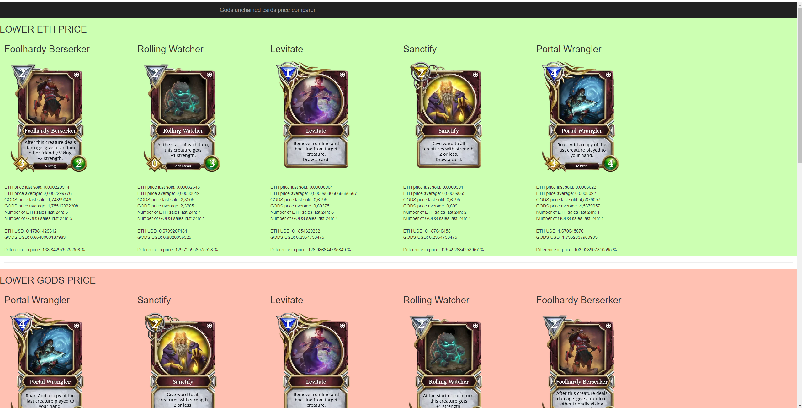

# GodsUnchainedCardsComparerETHtoGODS
compare ETH to GODS prices

The programs calls api to list all cards and then get orders from imuteble x marketplace and compares prices of cards in ETH to GODS, so you know which cards to buy in what currency, and then sold them for profit.
It takes about 30+ min to load all cards data with all the prices.

